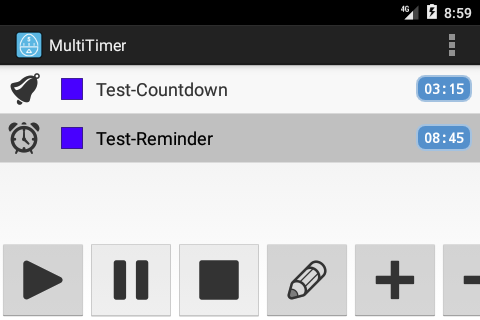
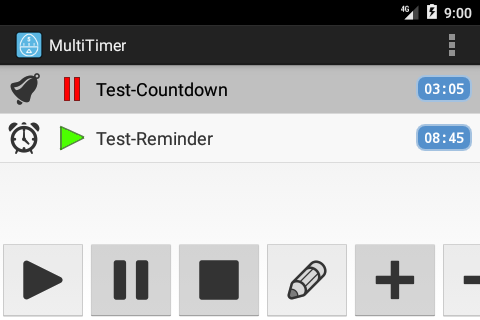
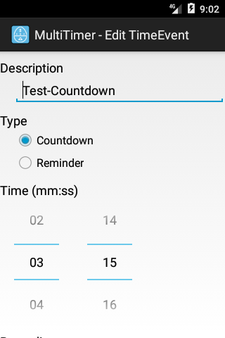
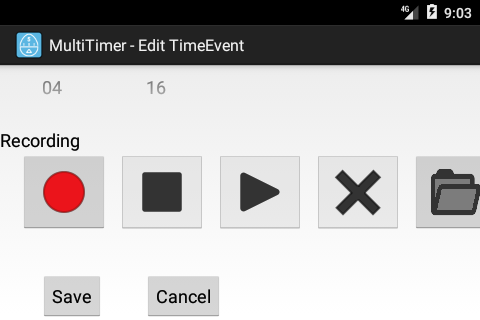
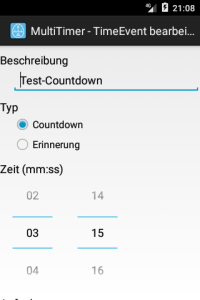
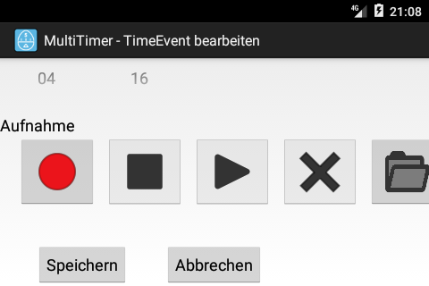

<h1>MultiTimer</h1>
Deutsch weiter unten! 

  
 

You can use your android device as a universal reminder tool. 
 
Just add a timer (countdown or reminder), set its parameters and activate it. 
A countdown counts down a time from maximal 59:59&nbsp;minutes (e.&nbsp;g. like 
the brewing time of 03:00&nbsp;minutes for a black tea) and fires a signal after 
00:00&nbsp;minutes is reached. A countdown can be paused to be resumed later 
(e.&nbsp;g. like in a judo match with disruptions by the referee). 
A reminder reminds you of a date between 00:00 and 23:59&nbsp;o'clock (e.&nbsp;g. a 
meeting at 14:30&nbsp;o'clock). If the reminder is set to a time, that has already passed, 
the time is assumed to be at the next day. 
 
You can make an audio recording for each timer, which is replayed, when a timer is fired. 
If you don't do, a default tone will be replayed (3 x 1319&nbsp;Hz, 125&nbsp;ms on, 
125&nbsp;ms off). 
If several timers fire at the same time, audio recordings or where necessary default tones 
are scheduled consecutively so you can't miss a timer acoustically. 
If you modify audio recordings in edit or add mode or add a new audio recording, 
the audio recording will be saved or updated only if you save these modification. 
Otherwise they are removed. Audio recordings are also removed, if the according timer 
is removed. 
 
You can setup the app's behaviour in the settings: 
Normal app 
If you leave the main activity of the MultiTimer-App no timers are updated or fired. 
This happens as soon as you return to the MultiTimer-App. 
Wakelock 
This mode is similar to Normal app, but the display is prevented from being switched 
off by standby as long as the main activity of the MultiTimer-App is in the foreground. 
Alarm mode and Notify 
A running timer is always fired, even if you are running another activity (another app or 
even a MultiTimer-activity like edit or settings). This can result in data loss in Alarm mode 
because the main activity of the MultiTimer-App is put into the foreground. In mode Notify 
a notification is displayed in the status bar where a click activates the main activity of the 
MultiTimer-App but which also just can be swept away. All running timers are also active 
during standby mode. If a running timer fires during standby mode, the device is waked 
up in Alarm mode. In mode Notify a notification is created without switching the device 
on. In the last case you will see the notification in the status bar when you turn on your device. 
If your device is switched off completely, all running timers are updated and fired 
if applicable after the app is launched again. 
 
All timers show their type in the list view (a clock for reminders, a bell for countdowns), 
their left or firing time plus their state. A blue square is a ready to run timer, 
a red double bar is a paused timer (countdowns only), a green triangle is a running timer 
and a yellow dot is a fired timer. 
 
 
<h1>MultiTimer</h1>

  
 

Nutzen Sie Ihr Smartphone als universelles Erinnerungswerkzeug. 
 
F&uuml;gen Sie einen Timer (Countdown oder Erinnerung) hinzu, setzen seine Parameter 
und aktivieren Sie ihn. 
Ein Countdown z&auml;hlt die Zeit von maximal 59:59&nbsp;Minuten (z.&nbsp;B. die Ziehzeit 
eines Schwarzen Tees von 03:00&nbsp;Minuten) herunter und feuert ein Signal, nachdem er 
die Zeit 00:00&nbsp;Minuten erreicht hat. Er kann pausiert werden, um sp&auml;ter 
wieder fortgesetzt zu werden (wie z.&nbsp;B. in einem Judo-Wettkampf mit 
Unterbrechung durch den Kampfrichter). 
Eine Erinnerung erinnert Sie an einen Termin zwischen 00:00 und 23:59&nbsp;Uhr (z.&nbsp;B. 
ein Meeting um 14:30&nbsp;Uhr). Wenn eine Erinnerung mit einer Zeit vor der aktuellen 
Zeit gesetzt wird, wird die Zeit f&uuml;r den n&auml;chsten Tag angenommen. 
 
Sie k&ouml;nnen zu jedem Timer eine kurze Sprachnotiz aufzeichnen, die beim Ausl&ouml;sen 
des Timers abgespielt wird. Nehmen Sie keine Notiz auf, wird ein Standardton abgespielt 
(3 x 1319&nbsp;Hz, 125&nbsp;ms an, 125&nbsp;ms aus). 
L&ouml;sen mehrere Timer zur gleichen Zeit aus, werden die Sprachnotizen bzw. ggf. die 
Standardt&ouml;ne nacheinander abgespielt. So k&ouml;nnen Sie akustisch keinen Timer verpassen. 
&auml;ndern Sie im Bearbeitungs- oder Hinzuf&uuml;gemodus Sprachnotizen oder f&uuml;gen Sie eine neue 
Sprachnotiz hinzu, werden diese nur beim Speichern auf dem Ger&auml;t gespeichert bzw. aktualisiert. 
Anderenfalls werden sie gel&ouml;scht. Sprachnotizen werden auch gel&ouml;scht, wenn der zugeh&ouml;rige 
Timer gel&ouml;scht wird. 
 
Sie haben die M&ouml;glichkeit, das App-Verhalten in den Einstellungen festzulegen: 
Normale App 
Verlassen Sie die Hauptaktivit&auml;t der MultiTimer-App, werden keine Timer aktualisiert oder 
ausgel&ouml;st. Das geschieht aber, wenn Sie zur Hauptaktivit&auml;t der MultiTimer-App zur&uuml;ckkehren. 
Wakelock 
Dieser Modus ist wie bei Normale App, nur dass das Abschalten des Displays deaktiviert wird, 
w&auml;hrend die Hauptaktivit&auml;t der MultiTimer-App im Vordergrund ist. 
Alarmmodus und Systemnachricht 
Ein laufender Timer l&ouml;st auch aus, wenn gerade eine andere Aktivit&auml;t im Vordergrund ist (eine 
andere App oder auch andere MultiTimer-Aktivit&auml;ten wie Bearbeiten oder Einstellungen). Dies 
kann im Alarmmodus eventuell zum Verlust von Eingaben f&uuml;hren, da die Hauptaktivit&auml;t der 
MultiTimer-App in den Vordergrund geholt wird. Im Modus Systemnachricht wird lediglich eine 
Systemnachricht in der Statuszeile angezeigt, die beim Klicken die Hauptaktivit&auml;t der 
MultiTimer-App in den Vordergrund holt, die aber auch einfach nur beiseite gewischt werden 
kann. Aktive Timer laufen auch w&auml;hrend des Standby-Modus Ihres Ger&auml;tes weiter. L&ouml;st ein 
Timer w&auml;hrend des Standby-Modus aus, wird das Ger&auml;t im Alarmmodus angeschaltet. Im Modus 
Systemnachricht wird nur eine Systemnachricht erzeugt, ohne dass das Ger&auml;t angeschaltet wird. 
Im letzteren Fall sehen Sie die Nachricht beim Anschalten Ihres Ger&auml;tes in der Statuszeile. 
Wird Ihr Ger&auml;t komplett ausgeschaltet, werden laufende Timer erst beim n&auml;chsten Start der App 
aktualisiert und l&ouml;sen ggf. aus. 
 
Timer zeigen in der Liste Ihrer Timer ihren Typ (Uhr f&uuml;r Erinnerung, Glocke f&uuml;r Countdown), 
ihre verbleibende oder ausl&ouml;sende Zeit sowie ihren Status an: ein blaues Viereck steht f&uuml;r 
einen startbereiten Timer, ein roter Doppelbalken f&uuml;r einen pausierten Timer (nur Countdowns), 
ein gr&uuml;nes Dreieck f&uuml;r einen laufenden Timer und ein gelber Kreis f&uuml;r einen ausgel&ouml;sten Timer. 